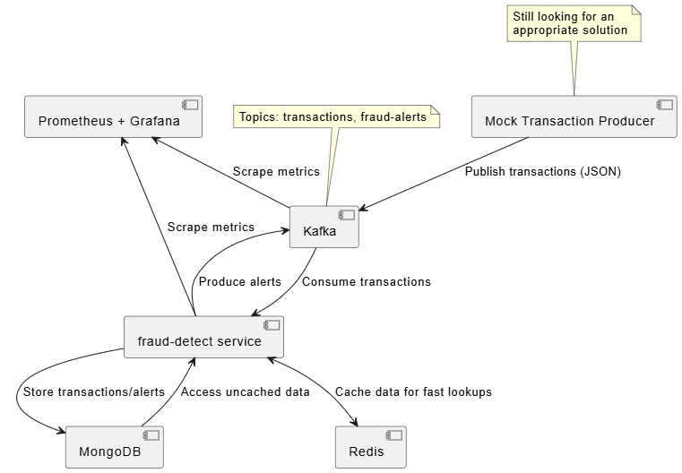

# **"fraud-detect" Initial Design**

## Project goal

This is a portifolio-focused project with the goal of honing and displaying skills when it comes to utilizing recent enterprise-level technologies. The proposal is an event-driven transaction processing system that implements simplified rule-based fraud detection methods, emmiting alerts when a suspicious transaction is processed.

# Proposed architecture

- Kafka Cluster
    - Stream transactions and fraud alerts

- fraud-detect service - Scala3 + Play + Pekko
    - Consume incoming transaction data from Kafka
    - Apply simple fraud detecting rules
    - Produce fraud alerts to Kafka
    - Expose endpoints for quering results

- MongoDb
    - Persist user profiles, transactions and alerts

- Redis
    - Cache user data (usual country) for faster rule lookup (See proposed rules bellow)
    - Cache transaction counts for faster rule lookup
    - Cache fraud alerts for faster API response

- Prometheus + Grafana
    - Performance monitoring

- TBD solution for generating hundreds or thousands of randomized mock transactions for performance insights

## Diagram

## Fraud detection rules:

Deep diving into machine learning and advanced fraud detection techniques is beyond my ambitions for this project, therefore we're going with a few simple rules. The following scenarios will trigger a fraud alert:

- ### High ammount 
    - Transaction ammount > 100000 USD
- ### Blacklisted merchant
    - Transaction to one of the blacklisted merchants stored in a Redis set (`blacklisted:merchants`)
- ### Suspicious location
    - Transaction occoured in a location different from the user's usual location stated in his user profile
- ### High frequency
    - Over 5 transactions per minute from the same user